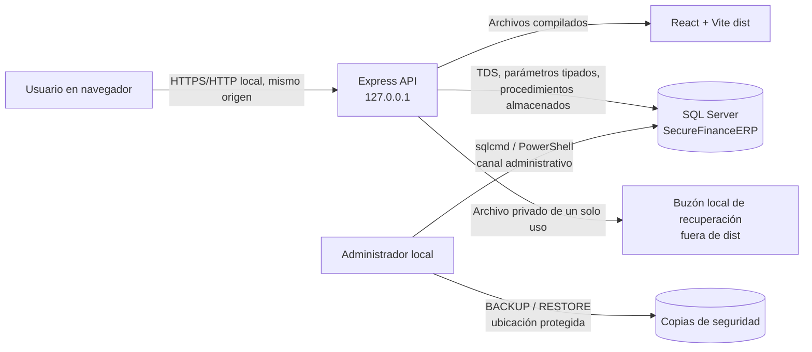
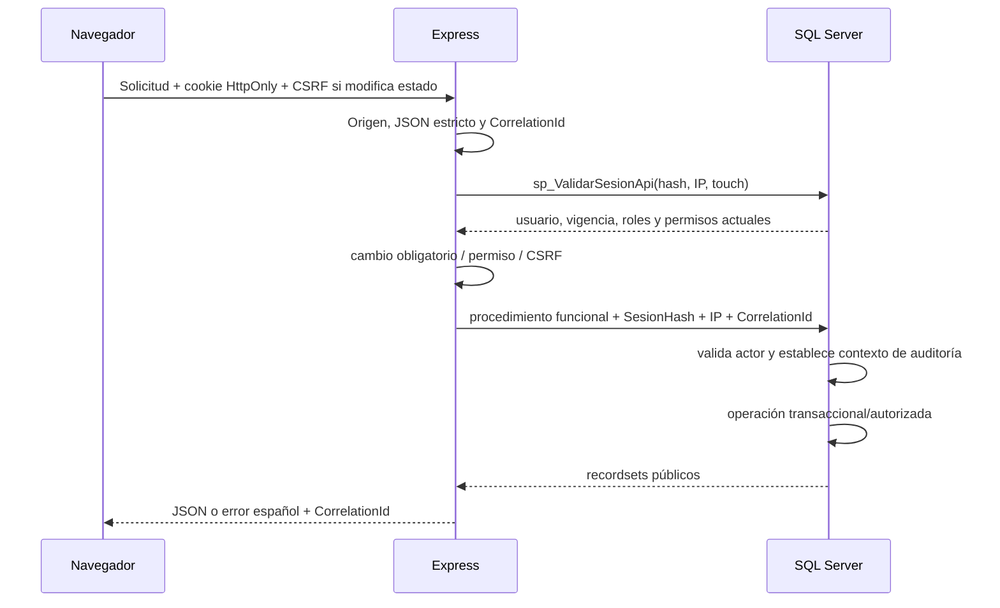

# Arquitectura

## Objetivo y alcance

SecureFinance ERP es una aplicación web local de un solo origen para autenticación, perfiles, ventas, productos, clientes, reportes, usuarios, roles y auditoría. La interfaz nunca abre conexiones a SQL Server. La API de Express es el único canal de operación de la aplicación y solo ejecuta procedimientos almacenados con parámetros tipados. La instalación, migración, respaldo y restauración usan un canal administrativo separado.

Quedan fuera del alcance devoluciones, anulaciones, compras, contabilidad general, múltiples sucursales y facturación electrónica.

## Topología local

### Límites de confianza

1. **Navegador no confiable.** Puede alterar rutas, cuerpos, precios, identificadores y permisos visibles. La API y SQL vuelven a validar identidad, propiedad, versión y autorización.
2. **API de aplicación.** Posee una cuenta SQL de mínimo privilegio. No instala objetos, no ejecuta DDL y no realiza DML directo.
3. **Base de datos.** Es la autoridad para sesiones, permisos, precios, IVA, stock, idempotencia, transacciones y auditoría.
4. **Canal administrativo.** Instala/migra objetos, crea el login mínimo, prepara el primer administrador y opera copias. No se expone por HTTP.
5. **Buzón de recuperación.** Es privado, local y ajeno al directorio público; el endpoint nunca devuelve el token.

## Componentes

| Componente | Responsabilidad | No debe hacer |
|---|---|---|
| `apps/web` | SPA React, rutas, accesibilidad, estados, temas y consumo de `/api`. | Conectarse a SQL, decidir permisos definitivos o calcular importes contables autoritativos. |
| `apps/api` | Contrato HTTP, esquema de entrada, cookies, CSRF, correlación, autorización y adaptación de recordsets. | Ejecutar DDL/DML directo, confiar en `UsuarioId` del cliente o revelar errores SQL. |
| `database` | Esquema, reglas, SP, TVP/TVF, transacciones, permisos y auditoría. | Confiar en precios/actor enviados por el navegador o sembrar datos al arrancar la API. |
| Pruebas distribuidas en `apps/*`, `database/tests` y `tests` | Vitest, integración con la identidad SQL real, humo HTTP, Playwright público/privado y scripts SQL; sigue sin existir arnés de carga de cinco sesiones. | Sustituir SQL Server por mocks para afirmar ACID, TVP, carreras o restauración. |
| `docs` | Operación, contratos, trazabilidad y evidencia. | Marcar una PA aprobada por inspección de código. |

## Ejecución

### Desarrollo

- Vite escucha únicamente en `127.0.0.1` y reenvía `/api` a Express.
- Express escucha únicamente en `127.0.0.1`.
- `pnpm dev` inicia web y API; SQL Server debe estar activo y preparado.

### Inicio integrado

1. `pnpm build` compila `apps/web/dist`.
2. `pnpm start` inicia Express.
3. Express sirve `/api/*` y, bajo el mismo origen, los archivos compilados y el fallback de la SPA.
4. El diseño no usa CDN ni servicios externos en runtime. La operación sin Internet es un objetivo de PA26/PA32 aún Pendiente; Playwright usa el Microsoft Edge instalado localmente y no descarga un navegador durante la prueba.

## Flujo de una solicitud protegida

Las consultas automáticas que solo comprueban sesión o apariencia deben usar `touch=false` para no prolongar artificialmente los 30 minutos de inactividad. La duración absoluta es de ocho horas.

## Autenticación y autorización

- Sesión opaca aleatoria; en SQL se guarda únicamente su digest SHA-512.
- Cookie `HttpOnly`, `SameSite=Strict`, `Path=/`; `Secure` cuando el origen sea HTTPS.
- CSRF de encabezado para métodos que cambian estado y comprobación de mismo origen.
- Cinco fallos en quince minutos se limitan por cuenta e IP en SQL; el límite HTTP general es complementario.
- Cada operación protegida vuelve a comprobar vigencia, usuario activo, revocación y permisos desde SQL.
- Ocultar navegación mejora la UX, pero no concede ni retira autoridad.
- Una sesión con cambio inicial obligatorio solo accede a cambio de contraseña, apariencia local y cierre.

### Política base de roles

| Perfil | Capacidades iniciales |
|---|---|
| Administrador bootstrap | `provision-bootstrap-admin.sql` asigna los permisos activos de administración, catálogos, reportes y auditoría, pero excluye `VENTAS_CREAR`; vender exige asignarlo explícitamente mediante otro rol. |
| Cajero | Crear ventas y consultar sus propias facturas. |
| Auditor | Consultar reportes y bitácoras; no modifica catálogos. |
| Sin roles | Perfil, seguridad, apariencia y cierre de sesión, sin funciones de negocio. |

El nombre del rol no sustituye la comprobación de permisos efectivos. `REPORTES_LEER` permite consultar todas las facturas y métricas. Sin ese permiso, una consulta de factura exige propiedad de la venta.

## Venta transaccional

1. El navegador envía cliente, producto/cantidad y solicita cotización.
2. SQL valida cliente/productos activos, obtiene precios y stock, agrupa el detalle y calcula subtotal e IVA.
3. El navegador confirma productos, cantidades, cliente, total aceptado como cadena y UUID de idempotencia.
4. SQL serializa la clave por usuario, compara la huella canónica y ejecuta encabezado, detalle, stock, caja y auditoría en una transacción con `XACT_ABORT` y `TRY/CATCH`.
5. Misma clave y contenido devuelve la misma factura; contenido distinto produce `409 IDEMPOTENCY_CONFLICT`.
6. Ante una respuesta incierta, el borrador conserva la clave y consulta el resultado. No genera otra venta ni otra clave hasta resolverlo.

El comprobante usa las instantáneas históricas de cliente, cajero, moneda, impuesto, producto y precio. Consultar o imprimir no registra otra venta.

## Datos, tiempo e importes

- Autoridad contable: `DECIMAL(19,2)` en SQL.
- Transporte: cadenas con exactamente dos decimales; nunca `Number` como fuente contable.
- IVA académico: `ROUND(subtotal * 0.12, 2)` una sola vez en el encabezado.
- Fechas persistidas en UTC. Los filtros de día se convierten en el servidor a intervalos UTC correctos para la zona configurada.
- Paginación en servidor: 10, 25 o 50 filas, 25 por defecto; orden estable con desempate por clave.

## Auditoría y pool

La identidad de aplicación proviene de la sesión. Cada SP protegido establece contexto de auditoría en la misma conexión que modifica datos y lo limpia incluso al fallar. Las pruebas deben alternar cuentas sobre un pool reutilizado para demostrar que no queda contexto residual.

- Accesos: resultado, motivo interno, principal SQL e IP observada.
- DML: triggers por conjuntos, una entrada por fila afectada; un rollback no deja auditoría DML de la transacción revertida.
- DDL: trigger de base para cambios de esquema por el canal administrativo.
- Nunca se registran contraseñas, hashes, salts, tokens, cookies ni cadenas de conexión.

## Disponibilidad y fallos

| Estado | Presentación/contrato |
|---|---|
| Carga | Indicador contextual; no tabla vacía temporal. |
| Sin registros | Mensaje válido y acción siguiente. |
| Sin coincidencias | Conserva filtros y permite limpiarlos. |
| Validación | Señala campos y conserva valores no sensibles. |
| Conflicto | `409`, solicita actualizar o explica idempotencia/stock. |
| Sesión | `401`, limpia datos sensibles y vuelve a acceso. |
| Prohibición | `403`, sin revelar datos. |
| Servicio/SQL | `503`, nunca se presenta como total cero o venta revertida confirmada. |
