# ERD físico

Este modelo corresponde al esquema `dbo` declarado por los scripts de `database/`. El diagrama muestra columnas físicas, claves y relaciones declarativas; los campos de auditoría sin clave foránea se describen después del diagrama. `rowversion` se representa como `binary8` porque Mermaid no admite todos los tipos de SQL Server.

```mermaid
erDiagram
    Permiso {
        int PermisoId PK
        varchar60 Codigo UK
        nvarchar120 Nombre
        varchar40 Modulo
        bit Activo
        datetime2 CreadoUtc
        datetime2 ActualizadoUtc
        binary8 VersionFila
    }
    Rol {
        int RolId PK
        varchar60 Nombre UK
        nvarchar250 Descripcion
        bit EsAdministrador
        bit Activo
        datetime2 CreadoUtc
        datetime2 ActualizadoUtc
        binary8 VersionFila
    }
    Usuario {
        int UsuarioId PK
        varchar50 NombreUsuario UK
        nvarchar120 NombreVisible
        nvarchar254 CorreoRecuperacion
        varbinary64 PasswordHash
        varbinary32 PasswordSalt
        bit DebeCambiarPassword
        bit Activo
        int VersionSeguridad
        datetime2 CreadoUtc
        datetime2 ActualizadoUtc
        datetime2 UltimoCambioPasswordUtc
        binary8 VersionFila
    }
    Usuario_Rol {
        int UsuarioId PK,FK
        int RolId PK,FK
        datetime2 AsignadoUtc
        int AsignadoPorUsuarioId FK
    }
    Rol_Permiso {
        int RolId PK,FK
        int PermisoId PK,FK
        datetime2 AsignadoUtc
        int AsignadoPorUsuarioId FK
    }
    Sesion {
        bigint SesionId PK
        varbinary64 SesionHash UK
        int UsuarioId FK
        int VersionSeguridad
        smallint MinutosInactividad
        datetime2 CreadaUtc
        datetime2 UltimaActividadUtc
        datetime2 ExpiraInactividadUtc
        datetime2 ExpiraAbsolutaUtc
        datetime2 RevocadaUtc
        varchar45 DireccionIP
        nvarchar300 AgenteUsuario
        uniqueidentifier CorrelationId
    }
    TokenRecuperacion {
        bigint TokenRecuperacionId PK
        int UsuarioId FK
        varbinary64 TokenHash UK
        datetime2 CreadoUtc
        datetime2 ExpiraUtc
        datetime2 UsadoUtc
        datetime2 RevocadoUtc
        varchar45 DireccionIP
        uniqueidentifier CorrelationId
    }
    PreferenciaUsuario {
        int UsuarioId PK,FK
        varchar10 Tema
        datetime2 ActualizadoUtc
        binary8 VersionFila
    }
    UnidadMedida {
        varchar20 Codigo PK
        nvarchar80 Nombre
        bit Activo
    }
    ConfiguracionSistema {
        tinyint ConfiguracionId PK
        char3 MonedaCodigo
        nvarchar64 ZonaHorariaIana
        sysname ZonaHorariaSql
        decimal TasaIVA
        datetime2 ActualizadoUtc
        binary8 VersionFila
    }
    Cliente {
        int ClienteId PK
        varchar30 Identificador UK
        nvarchar120 Nombre
        nvarchar254 Correo
        nvarchar30 Telefono
        bit Activo
        datetime2 CreadoUtc
        datetime2 ActualizadoUtc
        binary8 VersionFila
    }
    Producto {
        int ProductoId PK
        varchar30 Codigo UK
        nvarchar160 Descripcion
        varchar20 Unidad FK
        decimal Precio
        int Stock
        bit Activo
        datetime2 CreadoUtc
        datetime2 ActualizadoUtc
        binary8 VersionFila
    }
    MovimientoInventario {
        bigint MovimientoInventarioId PK
        int ProductoId FK
        int Variacion
        int StockAnterior
        int StockNuevo
        nvarchar250 Motivo
        int UsuarioId FK
        datetime2 FechaUtc
        uniqueidentifier CorrelationId
    }
    Factura {
        bigint FacturaId PK
        bigint Numero UK
        varchar20 Estado
        int ClienteId FK
        varchar30 ClienteIdentificador
        nvarchar120 ClienteNombre
        int UsuarioId FK
        nvarchar120 CajeroNombre
        datetime2 FechaUtc
        char3 Moneda
        decimal TasaIVA
        decimal Subtotal
        decimal IVA
        decimal Total
        uniqueidentifier ClaveIdempotencia
        varbinary32 HuellaContenido
        uniqueidentifier CorrelationId
    }
    Detalle_Factura {
        bigint DetalleFacturaId PK
        bigint FacturaId FK
        int ProductoId FK
        varchar30 ProductoCodigo
        nvarchar160 ProductoDescripcion
        varchar20 Unidad
        int Cantidad
        decimal PrecioUnitario
        decimal Importe
    }
    MovimientoCaja {
        bigint MovimientoCajaId PK
        bigint FacturaId FK,UK
        varchar20 Tipo
        decimal Importe
        char3 Moneda
        int UsuarioId FK
        datetime2 FechaUtc
    }
    Bitacora_Acceso {
        bigint BitacoraAccesoId PK
        datetime2 FechaUtc
        varchar254 NombreUsuarioIntentado
        int UsuarioId FK
        varchar30 Resultado
        nvarchar250 MotivoInterno
        varchar45 DireccionIP
        nvarchar300 AgenteUsuario
        nvarchar128 PrincipalSql
        nvarchar128 HostName
        nvarchar128 AppName
        uniqueidentifier CorrelationId
    }
    Bitacora_Transacciones {
        bigint BitacoraTransaccionId PK
        datetime2 FechaUtc
        sysname Tabla
        varchar10 Operacion
        nvarchar200 RegistroId
        int UsuarioAplicacionId
        varchar50 UsuarioAplicacion
        nvarchar128 PrincipalSql
        nvarchar128 HostName
        nvarchar128 AppName
        varchar45 DireccionIP
        uniqueidentifier CorrelationId
        nvarchar250 Motivo
        nvarcharmax ValoresAnteriores
        nvarcharmax ValoresNuevos
    }
    Bitacora_DDL {
        bigint BitacoraDDLId PK
        datetime2 FechaUtc
        sysname TipoEvento
        sysname TipoObjeto
        sysname NombreObjeto
        sysname Esquema
        nvarcharmax Comando
        nvarchar128 PrincipalSql
        varchar50 UsuarioAplicacion
        nvarchar128 HostName
        nvarchar128 AppName
        uniqueidentifier CorrelationId
        xml DatosEvento
    }
    Bitacora_Incidente {
        bigint BitacoraIncidenteId PK
        datetime2 FechaUtc
        varchar80 Operacion
        int UsuarioId
        uniqueidentifier CorrelationId
        int NumeroError
        nvarchar500 MensajeSanitizado
        nvarchar128 PrincipalSql
        nvarchar128 HostName
        nvarchar128 AppName
    }
    SchemaMigration {
        varchar100 MigrationId PK
        nvarchar250 Descripcion
        datetime2 AplicadaUtc
        sysname AplicadaPor
    }

    Usuario ||--o{ Usuario_Rol : recibe
    Rol ||--o{ Usuario_Rol : agrupa
    Rol ||--o{ Rol_Permiso : concede
    Permiso ||--o{ Rol_Permiso : integra
    Usuario ||--o{ Sesion : abre
    Usuario ||--o{ TokenRecuperacion : solicita
    Usuario ||--o| PreferenciaUsuario : configura
    UnidadMedida ||--o{ Producto : clasifica
    Producto ||--o{ MovimientoInventario : registra
    Usuario ||--o{ MovimientoInventario : ejecuta
    Cliente ||--o{ Factura : identifica
    Usuario ||--o{ Factura : procesa
    Factura ||--|{ Detalle_Factura : contiene
    Producto ||--o{ Detalle_Factura : referencia
    Factura ||--|| MovimientoCaja : genera
    Usuario ||--o{ MovimientoCaja : registra
    Usuario o|--o{ Bitacora_Acceso : relaciona
```

## Relaciones y datos históricos

- `Usuario_Rol` y `Rol_Permiso` tienen clave primaria compuesta. `AsignadoPorUsuarioId` es opcional y referencia `Usuario`; el diagrama omite esas dos líneas autorreferentes para conservar legibilidad.
- `PreferenciaUsuario` usa `UsuarioId` como PK y FK: una cuenta tiene cero o una fila; la lectura resuelve `sistema` cuando aún no existe.
- `Factura` conserva instantáneas de identificador/nombre del cliente y nombre del cajero. `Detalle_Factura` conserva código, descripción, unidad y precio. Las FK permiten trazabilidad, pero las impresiones históricas no vuelven a leer esos textos desde el catálogo actual.
- `UQ_Factura_Usuario_Clave (UsuarioId, ClaveIdempotencia)` impide duplicar una venta por cuenta. `HuellaContenido` distingue un reintento idéntico de una reutilización conflictiva.
- `UQ_DetalleFactura_Factura_Producto` limita una línea por producto y `UQ_MovimientoCaja_Factura` un movimiento de caja por factura.
- `Bitacora_Transacciones.UsuarioAplicacionId` y `Bitacora_Incidente.UsuarioId` son datos de evidencia, no FK. Esto evita que cambios de seguridad o mantenimiento del catálogo rompan el registro. `Bitacora_DDL` tampoco depende de tablas de negocio.
- `ConfiguracionSistema` es una fila única (`ConfiguracionId = 1`) con moneda, zonas horarias e IVA. `SeqNumeroFactura` asigna el número comercial; los huecos de secuencia tras rollback son válidos y no representan facturas perdidas.
- `SchemaMigration` registra la línea base/migraciones aplicadas por el canal administrativo; no participa en operaciones HTTP.

## Restricciones físicas relevantes

| Área | Regla de base de datos |
|---|---|
| Usuario | `NombreUsuario` ASCII permitido, 3–50; salt de 32 bytes; hash de 64 bytes; `VersionSeguridad > 0`. |
| Contraseña | Política validada por función: 12–128 caracteres, mayúscula, minúscula, número y símbolo. |
| Sesión | hash único de 64 bytes; inactividad 5–1440 minutos; vencimiento por inactividad no supera el absoluto. |
| Tema | `claro`, `oscuro` o `sistema`. |
| Cliente | identificador 1–30, nombre 2–120; identificador único. |
| Producto | código 1–30, descripción 2–160, precio `0.01–999999.99`, stock `0–2147483647`; unidad referenciada. |
| Inventario | variación entera distinta de cero, motivo 10–250, stock anterior/nuevo no negativo. |
| Factura | solo estado `Confirmada`; dinero `DECIMAL(19,2)`; `Total = Subtotal + IVA`; huella de 32 bytes. |
| Detalle | cantidad 1–9999; importe igual a cantidad por precio exacto. |
| Caja | tipo único `INGRESO_VENTA`; importe positivo. |
| Auditoría | operación DML `INSERT`, `UPDATE` o `DELETE`; imágenes anterior/nueva, si existen, son JSON válido. |

## Índices principales

| Índice | Finalidad |
|---|---|
| `IX_Sesion_Usuario_Vigencia` | Resolver/revocar sesiones de una cuenta por vigencia. |
| `IX_TokenRecuperacion_Usuario_Vigencia` | Resolver tokens activos y revocar los anteriores. |
| `IX_Producto_Descripcion` | Búsqueda/paginación de productos con columnas de presentación incluidas. |
| `IX_Cliente_Nombre` | Búsqueda/paginación de clientes con contacto/estado incluidos. |
| `IX_Factura_Fecha` | Reportes cronológicos y totales por rango. |
| `IX_Factura_Usuario_Fecha` | Facturas propias por usuario y fecha. |
| `IX_BitacoraAcceso_Fecha` | Consulta de accesos por fecha. |
| `IX_BitacoraTransacciones_Fecha` | Consulta de auditoría DML por fecha. |
| `IX_BitacoraDDL_Fecha` | Consulta de auditoría DDL por fecha. |

Las restricciones e índices anteriores son diseño inspeccionado; su comportamiento se valida mediante PA/QC y permanece **Pendiente** hasta ejecutar la base real.
